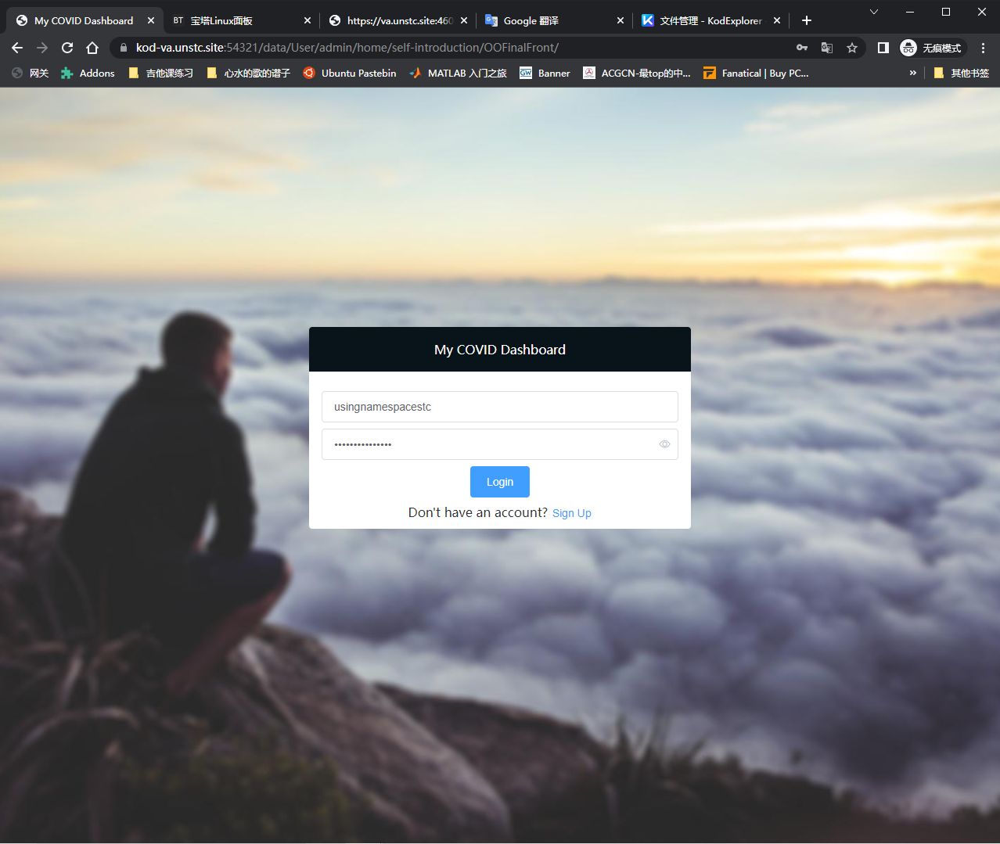
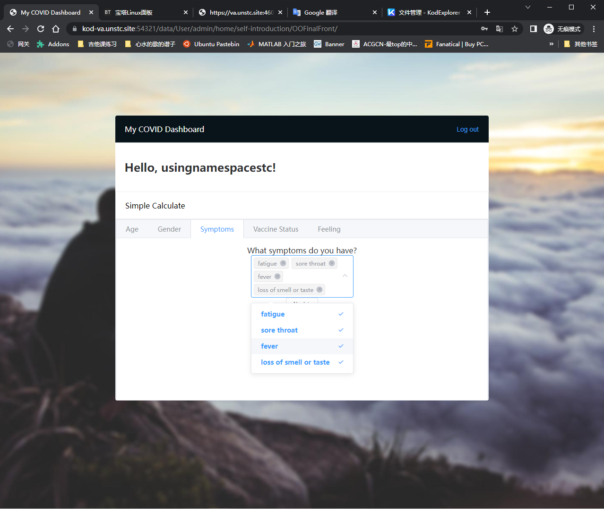
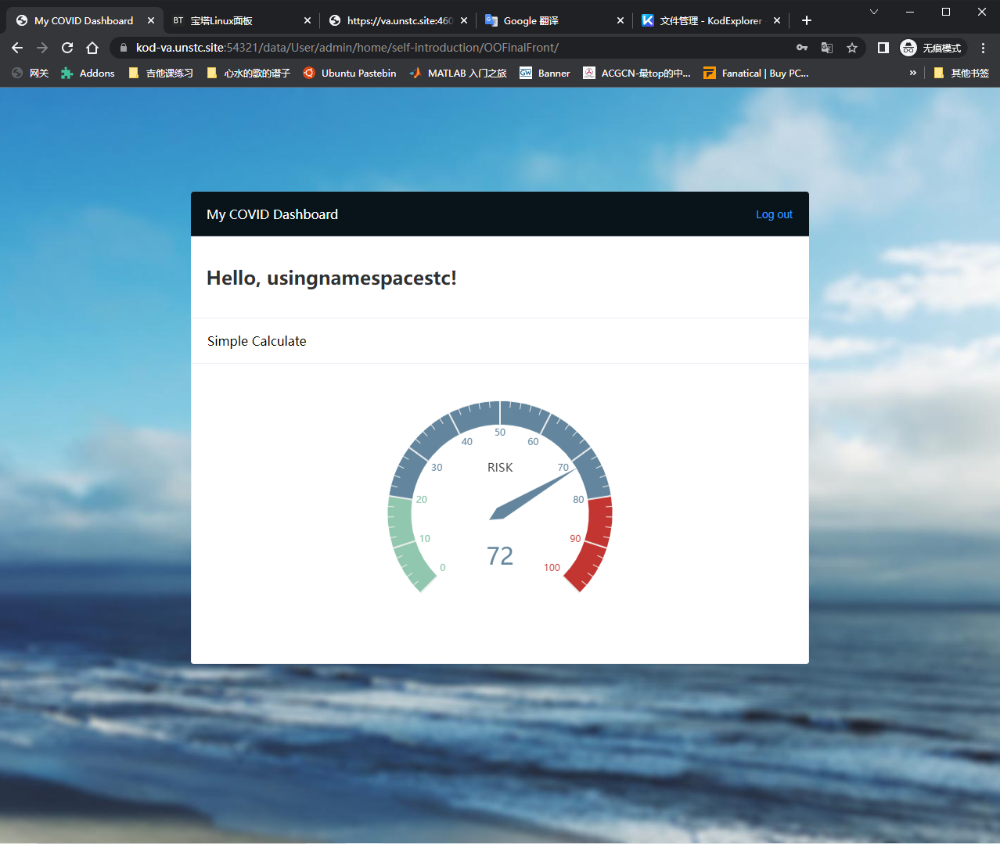

# OOFinalFront
This repo is the front end. <del>[Direct me to the back end.](https://github.com/usingnamespacestc/OOFinalBack)</del>

[Demo Link](https://kod-va.unstc.site:54321/data/User/admin/home/self-introduction/OOFinalFront/)</del>

## Library
|Name|Version|
|-|-|
|[Vue.js](https://github.com/vuejs/vue)|2.6.14|
|[elementui](https://github.com/ElementUI/lib)|2.15.7|
|[echarts](https://github.com/apache/echarts)|4.3.0|

## Usage
* Login or Signup & Login first

* Fill all the informations

* Calculate your COVID risk
